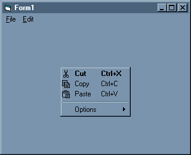



## Menu Items

### Description

An easy way to add images to menus (B & W).

Just a few API calls.
 
### More Info
 
You can use any picture just add it to the image list!

Please read the txt file included for more details

             |
---                |---
**Submitted On**   |2000-11-21 01:30:06
**By**             |[Abel Ricaurte](https://github.com/Planet-Source-Code/PSCIndex/blob/master/ByAuthor/abel-ricaurte.md)
**Level**          |Beginner
**User Rating**    |4.6 (23 globes from 5 users)
**Compatibility**  |VB 6\.0
**Category**       |[Coding Standards](https://github.com/Planet-Source-Code/PSCIndex/blob/master/ByCategory/coding-standards__1-43.md)
**World**          |[Visual Basic](https://github.com/Planet-Source-Code/PSCIndex/blob/master/ByWorld/visual-basic.md)
**Archive File**   |[CODE\_UPLOAD1188711212000\.zip](https://github.com/Planet-Source-Code/abel-ricaurte-menu-items__1-12981/archive/master.zip)

